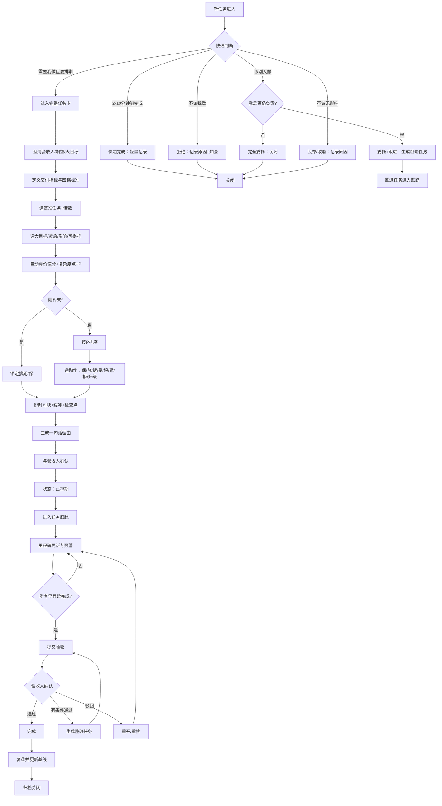
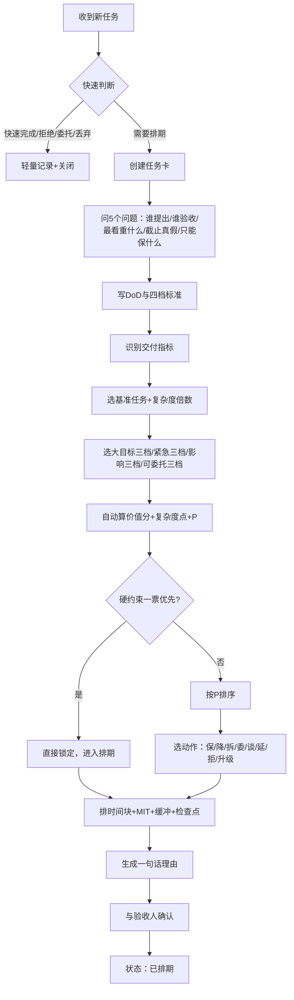
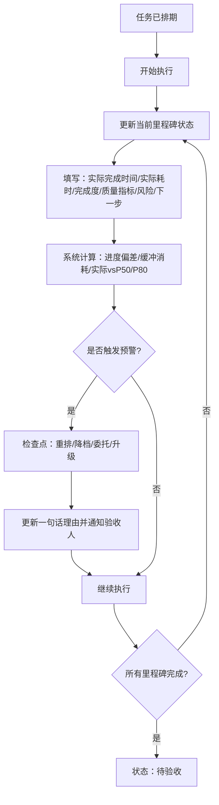
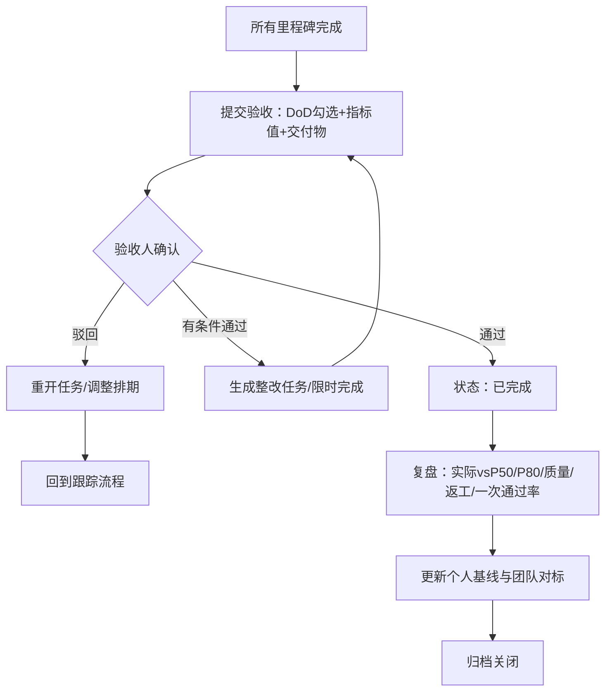
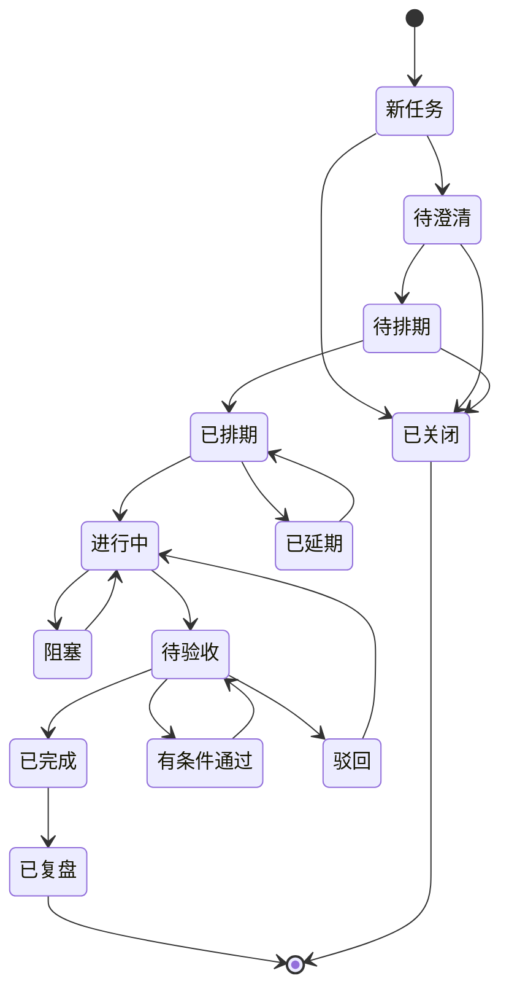
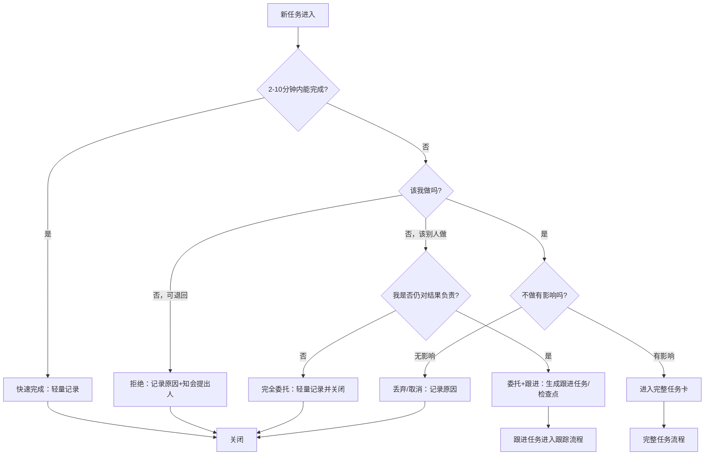

> ⚠️ **本文档已废弃（2026-09-27），仅作为思考轨迹保留，请勿据此实施。**
>
> 废弃原因：本稿设计了 **69 个任务卡字段**，远超个人使用场景所需，且未区分 MVP 与二期。
> 经需求收敛，字段压缩至 **9 个**，复用 Mindwtr 已有字段与机制承担其余部分。
>
> 现行文档：
> - 产品需求 → [`docs/requirements/承诺管理/承诺管理-PRD.md`](requirements/承诺管理/承诺管理-PRD.md)
> - 研发视角 → `docs/requirements/承诺管理/承诺管理-需求对齐.md`
>
> 本稿中仍然有效的内容：§1.1 问题定义、§6 业务流程、§9 多任务冲突重排、§10 快速终结路径
> （这些已在现行 PRD 中重新收录）。已作废的内容：§3 全部 69 个字段定义、§5.1 完整公式、
> §11 MVP 范围划分。

---

# 个人任务承诺管理系统 PRD v2.0（MVP）· 草稿 · 已废弃

## 0. 版本说明

| 版本 | 核心变化 |
|---|---|
| v1.0 | 完整公式 P=(A×I×U×V×M)÷(E×R)，7 个 1-5 分 |
| v2.0 | 改为基准任务锚点 + 三档下拉 + 自动算分；新增快速终结路径；保留一句话理由 |

**v2.0 核心原则：**
- 复杂模型藏在后台，简单操作留给用户。
- 不是所有任务都走完整流程，快速完成/拒绝/委托/丢弃走轻量记录。
- 用“相当于几个登录/注册”做复杂度基准。
- 优先级公式简化为：**P = 价值分 ÷ 复杂度点**。
- 硬约束一票优先。

---

## 1. 背景与目标

### 1.1 要解决的问题
- 任务来时靠感觉排，无法向验收人解释为什么这样排。
- 多任务并行容易乱，不知道保哪个、降哪个、委托哪个。
- 执行中缺少里程碑和量化指标，验收时才发现不达预期。
- 完成后没有复盘，无法积累自己的 P50/P80 基线。
- 所有任务都走重流程，导致系统变成垃圾场。

### 1.2 目标
让每个任务都能回答：
1. 为什么接、为什么这样排？
2. 什么时间做成什么样子？
3. 怎样算完成、优秀、卓越？
4. 冲突时怎么重排？
5. 验收人问起时，一句话讲清楚。

### 1.3 MVP 原则
- 单用户、手动更新、核心闭环。
- 基准任务锚点 + 三档下拉，不填 7 个 1-5 分。
- 快速终结路径必做。
- 不追求自动重排、日历集成、AI 生成。
- 先跑通闭环，后期再自动化。

---

## 2. 用户角色与场景

| 角色 | 说明 | MVP |
|---|---|---|
| 任务执行者 | 你本人，创建任务卡、排期、更新状态 | 是 |
| 提出人 | 发起任务的人 | 仅记录 |
| 验收人 | 最终判断是否通过的人 | 仅记录 |
| 被委托人 | 可部分承接任务的人 | 仅记录 |
| 系统 | 算优先级、偏差、预警、生成一句话理由 | 基础计算 |

典型场景：
- 领导临时插入汇报任务，你正在做客户方案。
- 家庭事项与绩效任务冲突。
- 多个任务都写“尽快”，需要重新排位。
- 验收人问：“为什么这个排在后面？”
- 任务进来后发现 5 分钟能做完，或该拒绝、该委托。

---

## 3. 核心业务术语与任务卡字段

### 3.1 基础信息

| 字段 | 术语含义 | 类型 | 必填 | 示例 |
|---|---|---|---|---|
| 任务ID | 唯一标识 | 文本 | 自动 | T-20260926-001 |
| 任务名称 | 要做什么 | 文本 | 是 | Q3 复盘 PPT |
| 提出人 | 谁发起 | 文本 | 是 | 张总 |
| 验收人 | 谁最终判断通过 | 文本 | 是 | 张总 |
| 任务来源 | 会议/IM/邮件/家庭 | 枚举 | 否 | 会议 |
| 创建时间 | 任务进入系统时间 | 日期时间 | 自动 | 2026-09-26 10:00 |
| 当前状态 | 生命周期状态 | 枚举 | 自动 | 已排期 |
| 关闭类型 | 快速终结时的关闭原因 | 枚举 | 否 | 快速完成 |

### 3.2 期望与目标

| 字段 | 术语含义 | 类型 | 必填 | 示例 |
|---|---|---|---|---|
| 期望类型 | 验收人最看重什么 | 多选：时间/质量/范围/成本/风险/呈现/政治效果 | 是 | 时间、质量 |
| 期望描述 | 原话或转述 | 文本 | 是 | 周五前给领导看，数据不能错 |
| 大目标-绩效 | 对绩效的贡献 | 三档：直接/支持/无关 | 是 | 直接 |
| 大目标-能力 | 对能力积累的贡献 | 三档：直接/支持/无关 | 是 | 支持 |
| 大目标-家庭 | 对家庭幸福的贡献 | 三档：直接/支持/无关 | 是 | 无关 |
| 大目标-健康 | 对健康的贡献 | 三档：直接/支持/无关 | 否 | 无关 |

### 3.3 交付指标与四档标准

| 字段 | 术语含义 | 类型 | 必填 | 示例 |
|---|---|---|---|---|
| 交付指标 | 判断交付好坏的 3-5 个关键指标 | 列表 | 是 | 错误数、一次通过率、页数、结论数 |
| 指标权重 | 每个指标的重要性 | 百分比 | 否 | 错误数 40% |
| 不合格线 | 不满足底线，不可验收 | 文本 | 是 | 数据有错、超时 |
| 合格线/DoD | 完成的定义，可检验 | 文本/清单 | 是 | 10 页、数据无错、按时交 |
| 优秀线 | 关键指标超预期 | 文本 | 否 | 结论先行、一次通过、领导不用改 |
| 卓越线 | 形成标杆、可复用、战略价值 | 文本 | 否 | 模板被团队复用、推动决策 |
| 目标档位 | 本次要做到哪一档 | 枚举 | 是 | 优秀 |

### 3.4 基准与估时

| 字段 | 术语含义 | 类型 | 必填 | 示例 |
|---|---|---|---|---|
| 基准任务 | 从基准库选一个最接近的任务 | 枚举 | 是 | 10 页汇报 PPT |
| 复杂度倍数 | 比基准简单/差不多/复杂 | 三档：0.5/1/2 | 是 | 2 |
| 复杂度点 | 基准点 × 倍数 | 计算 | 自动 | 4 |
| P50 | 自己历史同类任务正常耗时 | 小时/天 | 自动带出 | 3h |
| P80 | 自己历史同类任务保守耗时 | 小时/天 | 自动带出 | 5h |
| 团队中位 | 同级别同事一般耗时 | 小时/天 | 自动带出 | 4h |
| SLA/组织要求 | 外部或组织承诺时长 | 小时/天 | 否 | 48h |
| 计划投入 | 预计投入时间 | 小时 | 是 | 10h |

### 3.5 简化评分

| 字段 | 术语含义 | 类型 | 必填 | 示例 |
|---|---|---|---|---|
| 大目标分 | 绩效/能力/家庭取最高档 | 计算 | 自动 | 3 |
| 紧急分 | 硬截止 48h/本周/无 | 三档：3/2/1 | 是 | 3 |
| 影响分 | 验收人/项目重大/一般/轻微 | 三档：3/2/1 | 是 | 3 |
| 可委托分 | 必须我/可部分/可委托 | 三档：3/2/1 | 是 | 3 |
| 价值分 | 大目标+紧急+影响+可委托 | 计算 | 自动 | 12 |
| 优先级 P | 价值分 ÷ 复杂度点 | 计算 | 自动 | 3.0 |
| 硬约束 | 不可谈判项 | 多选：健康/家庭底线/合规/外部硬截止/关键路径 | 是 | 外部硬截止 |

### 3.6 排期与跟踪

| 字段 | 术语含义 | 类型 | 必填 | 示例 |
|---|---|---|---|---|
| 硬截止 | 不可谈截止 | 日期时间 | 是 | 周五 12:00 |
| 软截止 | 可谈判截止 | 日期时间 | 否 | 周五 18:00 |
| 时间块 | 安排在哪个时间段 | 时间段 | 是 | 周二 9:00-12:00 |
| MIT | 当天最重要任务 | 布尔 | 否 | 是 |
| 缓冲 | 预留的机动时间 | 小时/百分比 | 是 | 2h |
| 检查点 | 强制回顾时间 | 日期时间 | 是 | 周三 17:00 |
| 里程碑 | 阶段交付节点 | 列表 | 是 | 提纲/初稿/评审/终稿 |
| 交付物 | 每个里程碑的可验收产物 | 文本/附件 | 是 | 10 页 PPT |
| 交付状态 | 未交付/部分交付/已交付/已验收/驳回 | 枚举 | 自动 | 部分交付 |
| 进度偏差 | 实际完成度/计划完成度 | 计算 | 自动 | 0.8 |
| 缓冲消耗 | 已用缓冲/总缓冲 | 计算 | 自动 | 60% |
| 实际耗时 | 实际投入 | 小时 | 是 | 11h |
| 风险 | 当前风险 | 文本 | 否 | 数据延迟 |
| 下一步 | 接下来做什么 | 文本 | 是 | 等数据后修订 |

### 3.7 验收与复盘

| 字段 | 术语含义 | 类型 | 必填 | 示例 |
|---|---|---|---|---|
| 验收结果 | 通过/有条件通过/驳回 | 枚举 | 是 | 有条件通过 |
| 验收意见 | 验收人反馈 | 文本 | 否 | 数据再核一遍 |
| 实际 vs P50/P80 | 实际耗时与基线比较 | 计算 | 自动 | 超 P80 |
| 一次通过率 | 一次评审通过次数/总次数 | 计算 | 自动 | 0/1 |
| 返工率 | 返工工时/总工时 | 计算 | 自动 | 20% |
| 复盘记录 | 做得好/待改进 | 文本 | 是 | 下次提前要数据 |
| 基线更新 | 更新个人 P50/P80 | 手动 | 是 | P80 调整为 12h |

### 3.8 快速终结字段

| 字段 | 术语含义 | 类型 | 必填 | 示例 |
|---|---|---|---|---|
| 处理类型 | 快速完成/拒绝/完全委托/委托跟进/丢弃/取消/稍后 | 枚举 | 是 | 快速完成 |
| 关闭原因 | 为什么这样处理 | 文本 | 是 | 5 分钟能做完 |
| 是否知会 | 是否已告知提出人/验收人 | 布尔 | 是 | 是 |
| 实际耗时 | 快速完成耗时 | 小时 | 快速完成必填 | 0.1h |
| 被委托人 | 委托给谁 | 文本 | 委托必填 | 小王 |
| 跟进检查点 | 何时检查委托结果 | 日期时间 | 委托跟进必填 | 周五 17:00 |
| 一句话理由 | 为什么这样处理 | 文本 | 是 | 5 分钟内完成，不影响关键路径 |

---

## 4. 基准库

### 4.1 复杂度基准表

| 基准任务 | 复杂度点 | P50 | P80 | 团队中位 | 合格线示例 |
|---|---|---|---|---|---|
| 写周报 | 1 | 0.5h | 1h | 0.5h | 按时发、无错 |
| 10 页汇报 PPT | 2 | 3h | 5h | 4h | 数据无错、结论清晰 |
| 登录/注册功能 | 3 | 1天 | 2天 | 1.5天 | 主流程通、无阻塞 bug |
| 客户方案初稿 | 3 | 4h | 8h | 6h | 覆盖需求、可评审 |
| Q3 复盘汇报 | 5 | 6h | 10h | 8h | 一次通过、领导不改 |
| 小型数据迁移 | 8 | 2天 | 4天 | 3天 | 数据一致、可回滚 |

### 4.2 基准维护
- MVP 手动建 5-10 个基准。
- 每完成一个任务，复盘时更新实际耗时和质量。
- 基准越用越准。

### 4.3 大目标基准

| 大目标 | 直接（3分） | 支持（2分） | 无关（1分） |
|---|---|---|---|
| 绩效 | 直接关联 OKR/KPI/晋升 | 支持关键项目 | 日常杂事 |
| 能力 | 形成作品/证书/可复用资产 | 练习提升 | 重复劳动 |
| 家庭 | 不可逆关键陪伴/健康 | 重要但可调整 | 低影响 |
| 健康 | 影响身体底线 | 有影响 | 无影响 |

### 4.4 紧急/影响/可委托基准

| 维度 | 3分 | 2分 | 1分 |
|---|---|---|---|
| 紧急 | 硬截止 48h 内 | 本周内 | 无硬截止 |
| 影响 | 验收人/项目重大 | 一般 | 轻微 |
| 可委托 | 必须我做 | 可部分委托 | 可完全委托 |

---

## 5. 简化公式

### 5.1 优先级公式

**P = 价值分 ÷ 复杂度点**

其中：
- 价值分 = 大目标分 + 紧急分 + 影响分 + 可委托分
- 大目标分 = max(绩效分, 能力分, 家庭分, 健康分)
- 复杂度点 = 基准点 × 倍数

### 5.2 硬约束一票优先

以下项直接锁定，不参与普通排序：
- 健康底线
- 家庭不可逆事项
- 法律合规
- 外部硬截止
- 关键路径

### 5.3 计算示例

| 任务 | 大目标 | 紧急 | 影响 | 可委托 | 价值分 | 复杂度 | P |
|---|---|---|---|---|---|---|---|
| Q3 复盘 | 3 | 3 | 3 | 3 | 12 | 5 | 2.4 |
| 写周报 | 2 | 2 | 1 | 1 | 6 | 1 | 6.0 |
| 客户方案 | 3 | 2 | 3 | 2 | 10 | 3 | 3.3 |
| 临时数据核对 | 2 | 3 | 2 | 1 | 8 | 2 | 4.0 |

P 越高越先做。硬约束一票优先。

### 5.4 一句话理由模板

**长版：**
> 因为【验收人】最看重【指标】，合格/优秀/卓越线是【】；它相当于【基准任务】×【倍数】，复杂度【】点，对绩效是【直接/支持/无关】；同类任务我的 P50 是【】，P80 是【】，团队中位是【】；所以我安排在【时间】，投入【精力】，在【检查点】交付【交付物】，达到【档位】；若【风险】触发，就【动作】。

**短版：**
> 我按【硬约束+高价值+低复杂度】优先，把【任务】排在【时间】，承诺【DoD】，用【P80】留缓冲；【其他任务】已【降档/委托/延期】，检查点在【】，风险触发就【升级】。

**快速终结版：**
> 该任务【5 分钟内可完成/不属于我职责/可由他人完全负责/不做无影响】，所以我【快速完成/拒绝/委托/丢弃】，已【知会/未知会】提出人。

---

## 6. 业务流程

### 6.1 总体流程

### 6.2 新任务进来：怎么排

### 6.3 任务跟踪：怎么更新里程碑与交付状态

任务跟踪 = **里程碑驱动 + 指标校准 + 预警重排**。

**里程碑字段：**

| 字段 | 含义 | 示例 |
|---|---|---|
| 里程碑名称 | 阶段节点 | 初稿 |
| 目标日期 | 计划完成时间 | 周三 18:00 |
| 交付物 | 可验收产物 | 10 页 PPT 初稿 |
| DoD | 本阶段完成定义 | 数据无错、结论 3 条 |
| 状态 | 未开始/进行中/已完成/延期/阻塞/取消 | 进行中 |
| 实际完成时间 | 真实完成 | 周三 20:00 |
| 实际耗时 | 本阶段投入 | 4h |
| 完成度 | 0-100% | 70% |
| 质量指标 | 错误数/通过率等 | 错误 2 处 |
| 风险 | 当前风险 | 数据延迟 |
| 下一步 | 接下来动作 | 周四修订 |

**任务跟踪的三种更新方式：**
1. 手动更新：MVP 默认。
2. 检查点触发：到检查点必须更新，否则提醒。
3. 预警触发：进度偏差 <1、缓冲消耗 >50%、实际超 P80，自动提示重排。

**交付状态定义：**
- 未交付：里程碑未完成。
- 部分交付：部分里程碑完成，可给验收人看。
- 已交付：所有里程碑完成，等待验收。
- 已验收：验收人通过。
- 驳回：验收人要求返工。

### 6.4 任务完成

**完成时必填：**
- 实际耗时
- 实际 vs P50/P80
- 验收结果
- 复盘记录
- 基线是否更新

---

## 7. 任务状态机

**主状态：** 新任务 / 待澄清 / 待排期 / 已排期 / 进行中 / 待验收 / 已完成 / 已复盘 / 已关闭

**关闭类型（已关闭的子类）：** 快速完成 / 拒绝 / 完全委托 / 丢弃 / 取消

---

## 8. 预警规则

| 指标 | 公式 | 预警线 |
|---|---|---|
| 进度偏差 | 实际完成度/计划完成度 | <1 |
| 缓冲消耗 | 已用缓冲/总缓冲 | >50% |
| 实际耗时 | 实际 vs P50/P80 | >P80 |
| 一次通过率 | 一次通过次数/总次数 | 低则复盘 |
| 返工率 | 返工工时/总工时 | >20% |
| 对齐时间占比 | 某类目标时间/总时间 | 偏离目标权重 |

---

## 9. 多任务冲突重排

### 9.1 总原则

1. 底线优先：健康、家庭不可逆、法律合规、安全。
2. 硬截止优先：外部承诺、关键路径、不可逆节点。
3. 高价值优先：价值分高。
4. 低复杂度优先：P 高。
5. 只有你能做优先。
6. 可委托、可降档、可谈判的往后放。
7. 两个都硬且都只有你能做：升级，不硬扛。

### 9.2 重排五步法

1. 冻结冲突：列出冲突任务卡。
2. 识别冲突类型：时间、资源、依赖、验收人、目标冲突。
3. 硬约束筛选：不可谈的保，可谈的进入评分。
4. 重算 P：按价值分÷复杂度点排序。
5. 选动作 + 沟通：发冲突预警、方案、影响、请求决策。

### 9.3 八种处理动作

| 动作 | 适用 |
|---|---|
| 保 | 硬截止+高价值+只有我能做 |
| 降档 | 从优秀降到合格，保底线 |
| 拆分 | 先交初稿/框架，终稿后置 |
| 委托 | 可部分或完全交给别人 |
| 谈判 | 谈截止、范围、质量、资源 |
| 延期 | 软截止、低影响、可后置 |
| 拒绝 | 低价值、不属于你、重复劳动 |
| 升级 | 两个都硬、都只有你能做、资源不足 |

### 9.4 不混乱机制

- 单一任务池：所有任务进同一张表。
- 统一任务卡：字段一致。
- 统一优先级公式：P 值说话。
- 缓冲池：每周留半天机动。
- 每周重排：固定时间做。
- 升级机制：两个硬任务冲突，交给更高层决策。

---

## 10. 快速终结路径

### 10.1 处理类型

| 情况 | 定义 | 是否进完整任务卡 | 是否需跟进 | 是否计入主基线 |
|---|---|---|---|---|
| 快速完成 | 2-10 分钟内能做完 | 否，轻量记录 | 否 | 不计入，记碎片耗时 |
| 拒绝 | 不该你做，退回提出人 | 否，轻量记录 | 看是否达成一致 | 否 |
| 完全委托 | 别人负责，你不再对结果负责 | 否，轻量记录 | 否 | 否 |
| 委托但跟进 | 别人执行，你仍对结果负责 | 原任务关闭，生成跟进任务 | 是 | 跟进时间单独统计 |
| 丢弃/取消 | 无价值、重复、无效 | 否，轻量记录 | 否 | 否 |
| 稍后 | 现在不处理，未来可能做 | 可进待排期池 | 可选 | 否 |

### 10.2 快速终结流程

### 10.3 轻量记录字段

| 字段 | 必填 |
|---|---|
| 任务名称 | 是 |
| 来源/提出人 | 是 |
| 处理类型 | 是 |
| 关闭原因 | 是 |
| 是否知会 | 是 |
| 处理时间 | 自动 |
| 实际耗时 | 快速完成必填 |
| 被委托人 | 委托必填 |
| 跟进检查点 | 委托跟进必填 |
| 一句话理由 | 是 |

### 10.4 对统计与基线的影响

| 处理类型 | 计入完成率 | 计入 P50/P80 | 计入时间统计 |
|---|---|---|---|
| 快速完成 | 可计入碎片完成 | 否 | 是，碎片耗时 |
| 拒绝 | 否 | 否 | 决策耗时可选 |
| 完全委托 | 否 | 否 | 委托沟通耗时 |
| 委托但跟进 | 跟进任务计入 | 跟进时间单独统计 | 是 |
| 丢弃/取消 | 否 | 否 | 否 |
| 稍后 | 否 | 否 | 否 |

---

## 11. MVP 范围

### 11.1 MVP 要做

| 模块 | 功能 | 优先级 |
|---|---|---|
| 任务卡 | 创建/编辑/查看 | P0 |
| 快速终结 | 快速完成/拒绝/委托/丢弃/稍后 | P0 |
| 验收与指标 | 验收人、DoD、四档标准、交付指标 | P0 |
| 基准库 | 5-10 个基准任务，可增删改 | P0 |
| 简化评分 | 三档下拉，自动算价值分、复杂度点、P | P0 |
| 排期 | 时间块、硬截止、缓冲、检查点 | P0 |
| 里程碑 | 增删改，更新状态和完成度 | P0 |
| 任务跟踪 | 手动更新实际耗时、风险、下一步 | P0 |
| 一句话理由 | 模板生成，可复制 | P0 |
| 完成验收 | 提交验收、记录结果、复盘 | P0 |
| 冲突提示 | 同一时间块多个任务提示 | P1 |
| 看板/列表 | 今日/本周/待验收/风险/已关闭 | P1 |
| 基线记录 | 手动记录 P50/P80 | P1 |

### 11.2 MVP 不做

- 自动日历集成
- 自动 IM/邮件通知
- 多人权限与协作
- AI 自动生成任务卡
- 自动冲突重排算法
- 自动统计 P50/P80
- 复杂报表
- 验收人门户
- 每次填 7 个 1-5 分
- 复杂权重配置

### 11.3 后续迭代

| 版本 | 功能 |
|---|---|
| V1.1 | 自动计算 P50/P80，周报生成 |
| V1.2 | 冲突自动重排建议 |
| V1.3 | 日历/IM 集成，检查点提醒 |
| V1.4 | 验收人只读视图，在线确认 |
| V1.5 | 模板库、复盘知识库、个人效能看板 |

---

## 12. MVP 验收标准

1. 能创建一个任务卡，包含验收人、DoD、硬截止、四档标准。
2. 能从基准库选任务，选复杂度倍数，自动带出 P50/P80/团队中位。
3. 能选大目标/紧急/影响/可委托三档，自动算价值分、复杂度点、P。
4. 能排时间块、缓冲、检查点，生成一句话理由。
5. 能添加至少 3 个里程碑，并更新状态、实际耗时、完成度。
6. 系统能根据进度偏差、缓冲消耗给出预警。
7. 能提交验收，记录通过/有条件通过/驳回。
8. 能完成复盘，记录实际 vs P50/P80，并手动更新基线。
9. 新任务进入时，可在 10 秒内选择快速完成/拒绝/委托/丢弃/进入完整流程。
10. 快速终结任务保留在“已关闭”视图，可搜索。
11. 多任务冲突时，能在同一列表看到 P 排序和冲突提示。
12. 每类处理都能生成一句话理由。

---

## 13. 最小页面结构

1. **任务列表**：按 P、截止、状态筛选。
2. **任务详情/任务卡**：基础信息、指标、四档、基准、评分、排期、里程碑、一句话理由。
3. **今日/本周看板**：MIT、检查点、风险、待验收。
4. **快速处理入口**：新任务进来时的第一屏。
5. **已关闭视图**：快速完成/拒绝/委托/丢弃记录。
6. **冲突预警页**：同一时间块冲突任务、建议动作。
7. **复盘页**：实际 vs 计划、基线更新。
8. **基准库管理**：增删改基准任务。

---

## 14. 总结

v2.0 的核心变化：

**从复杂公式 → 基准锚点 + 三档下拉 + 自动算分。**

用户只需：
1. 选基准任务：相当于几个登录/注册？
2. 选复杂度：简单/差不多/复杂。
3. 选大目标：绩效/能力/家庭/健康，直接/支持/无关。
4. 选紧急：48h/本周/无。
5. 选影响：重大/一般/轻微。
6. 选可委托：必须我/可部分/可委托。

系统自动：
- 带出 P50/P80/团队中位
- 算价值分
- 算复杂度点
- 算优先级 P
- 生成一句话理由

新任务进来先走快速判断：
- 快速完成 / 拒绝 / 完全委托 / 委托跟进 / 丢弃 / 稍后 / 进入完整流程。

完整闭环：

**新任务进入 → 快速判断 → 澄清指标 → 选基准 → 算 P → 排期投入 → 里程碑跟踪 → 冲突重排 → 完成验收 → 复盘更新基线。**

一句话理由贯穿全程：

> 因为【指标/硬约束/基准对标】，所以我排在【时间】，承诺【DoD】，风险【】，检查点【】。

这个版本既能 MVP 落地，又保留了后期自动化和精细化的空间。